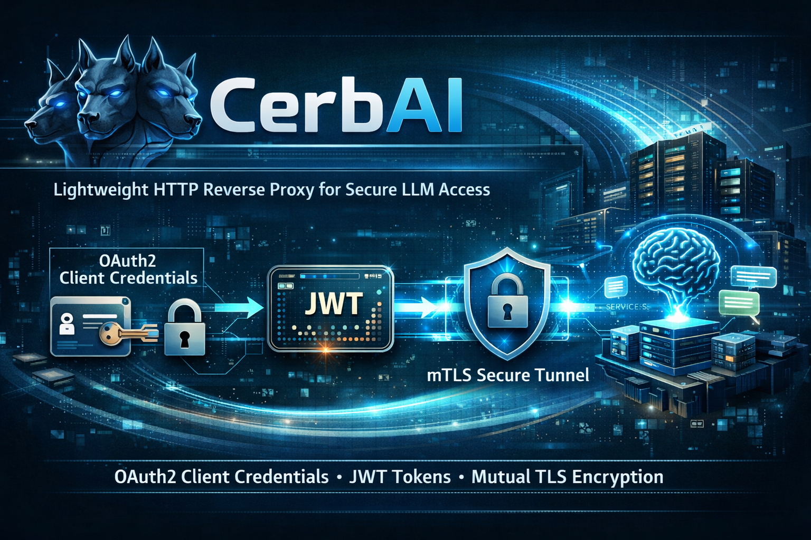

# CerbAI



[](https://github.com/thomas-illiet/cerbai/actions/workflows/ci.yml)
[](https://github.com/thomas-illiet/cerbai/actions/workflows/release.yml)

CerbAI is a lightweight HTTP reverse proxy written in Go, designed for corporate environments where LLM access is protected by a JWT obtained through an OAuth2 `client_credentials` flow over mTLS. It is Kubernetes-native: configured entirely through environment variables or CLI flags — no config file required.

## How it works

```none
Client (OpenAI SDK / curl)
        │
        ▼
   ┌─────────┐    client_credentials   ┌───────────────┐
   │ CerbAI  │ ─────── mTLS ─────────► │ Token Service │
   │  :8080  │ ◄──── JWT token ─────── └───────────────┘
   └────┬────┘    (memory or Redis)
        │  Authorization: Bearer <token>
        ▼
   ┌──────────┐
   │ LLM API  │
   └──────────┘
```

1. On each incoming request, CerbAI retrieves a valid JWT from its cache (memory or Redis).
2. On a cache miss, it refreshes the token via `client_credentials` over mTLS.
3. It injects the token into the `Authorization` header and forwards the request to the LLM.
4. SSE streaming responses (`text/event-stream`) are forwarded chunk by chunk with no buffering.

## Requirements

- Go 1.23+ (or Docker)
- A client certificate (cert + key) for mTLS
- Access to an internal token service and LLM endpoint
- Redis (optional, recommended for multi-replica deployments)

## Installation

### From source

```bash
git clone https://github.com/thomas-illiet/cerbai
cd cerbai
go build -o cerbai .
```

### Docker

```bash
docker pull ghcr.io/thomas-illiet/cerbai:latest
```

## Configuration

CerbAI is configured exclusively through **CLI flags** or **environment variables** — no config file needed.

### CLI flags

```
Usage:
  cerbai [flags]

Flags:
      --client-id string          OAuth2 client ID (env: CERBAI_CLIENT_ID)
      --client-secret string      OAuth2 client secret (env: CERBAI_CLIENT_SECRET)
  -h, --help                      help for cerbai
      --listen-addr string        Address to listen on (env: CERBAI_LISTEN_ADDR) (default ":8080")
      --llm-url string            Upstream LLM base URL (env: CERBAI_LLM_URL)
      --proxy-token string        Bearer token required to use the proxy, optional (env: CERBAI_PROXY_TOKEN)
      --redis-url string          Redis URL for shared token cache, optional (env: CERBAI_REDIS_URL)
      --tls-ca-file string        Custom CA certificate file, optional (env: CERBAI_TLS_CA_FILE)
      --tls-cert-file string      mTLS client certificate file path (env: CERBAI_TLS_CERT_FILE)
      --tls-key-file string       mTLS client key file path (env: CERBAI_TLS_KEY_FILE)
      --token-cache-ttl duration  Token cache TTL (env: CERBAI_TOKEN_CACHE_TTL) (default 5m0s)
      --token-endpoint string     OAuth2 token endpoint URL (env: CERBAI_TOKEN_ENDPOINT)
      --token-header string       Header name to inject the token into (env: CERBAI_TOKEN_HEADER) (default "Authorization")
      --token-prefix string       Token value prefix (env: CERBAI_TOKEN_PREFIX) (default "Bearer ")
      --log-level string          Log level: debug, info, warn, error (env: CERBAI_LOG_LEVEL) (default "info")
```

### Environment variables

| Variable                 | Default         | Description                                   |
| ------------------------ | --------------- | --------------------------------------------- |
| `CERBAI_LISTEN_ADDR`     | `:8080`         | Address to listen on                          |
| `CERBAI_LLM_URL`         | —               | Upstream LLM base URL                         |
| `CERBAI_TOKEN_ENDPOINT`  | —               | OAuth2 token endpoint URL                     |
| `CERBAI_CLIENT_ID`       | —               | OAuth2 client ID                              |
| `CERBAI_CLIENT_SECRET`   | —               | OAuth2 client secret                          |
| `CERBAI_TLS_CERT_FILE`   | —               | mTLS client certificate file path             |
| `CERBAI_TLS_KEY_FILE`    | —               | mTLS client key file path                     |
| `CERBAI_TLS_CA_FILE`     | —               | Custom CA file (optional, uses system CAs)    |
| `CERBAI_TOKEN_CACHE_TTL` | `5m`            | Token cache TTL                               |
| `CERBAI_TOKEN_HEADER`    | `Authorization` | Header name for token injection               |
| `CERBAI_TOKEN_PREFIX`    | `Bearer `       | Token value prefix                            |
| `CERBAI_PROXY_TOKEN`     | —               | Bearer token to access the proxy (optional)   |
| `CERBAI_REDIS_URL`       | —               | Redis URL (optional, see Token cache section) |
| `CERBAI_LOG_LEVEL`       | `info`          | Log level: debug, info, warn, error           |

## Running

### Minimal example

```bash
./cerbai \
  --llm-url https://llm.internal.example.com \
  --token-endpoint https://auth.internal.example.com/oauth2/token \
  --client-id my-client \
  --client-secret my-secret \
  --tls-cert-file /etc/certs/client.crt \
  --tls-key-file  /etc/certs/client.key
```

### With Docker Compose

```bash
cp .env.example .env
# Edit .env with your values

# Place your mTLS certificates in ./certs/
# certs/client.crt  certs/client.key  certs/ca.crt

docker compose up -d
```

This starts CerbAI alongside a Redis instance used for token caching.

## Token cache

CerbAI supports two cache backends:

### In-memory (default)

Local to each instance. Simple, no external dependency.

```bash
./cerbai --token-cache-ttl 10m ...
```

### Redis (optional — recommended for multi-replica)

All replicas share the same cached token. Avoids N simultaneous requests to the token service during a scale-out event.

```bash
./cerbai --redis-url redis://redis:6379/0 ...
# With TLS:
./cerbai --redis-url rediss://redis:6379/0 ...
```

| Behaviour             | Detail                                              |
| --------------------- | --------------------------------------------------- |
| Configurable TTL      | `--token-cache-ttl` (default: 5m)                   |
| Respects `expires_in` | Uses `min(configured TTL, expires_in - 30s)`        |
| Thread-safe (memory)  | `sync.RWMutex` with double-checked locking          |
| Atomic (Redis)        | Native `SET EX`, no mutex required                  |
| Startup warm-up       | Token pre-fetched at boot; non-fatal if unavailable |

## Proxy authentication

When `--proxy-token` (or `CERBAI_PROXY_TOKEN`) is set, all requests to the proxy must include a matching `Authorization` header. Omit the flag to disable auth entirely.

```bash
./cerbai --proxy-token my-secret-key ...
```

```bash
curl http://localhost:8080/v1/chat/completions \
  -H "Authorization: Bearer my-secret-key" \
  -H "Content-Type: application/json" \
  -d '{"model":"gpt-4","messages":[{"role":"user","content":"Hello!"}]}'
```

Requests without a valid token receive `401 Unauthorized`. The `/healthz` endpoint is always public.

## Health check

CerbAI exposes a health endpoint at `GET /healthz` that returns `200 ok` when the process is running.

```bash
curl http://localhost:8080/healthz
```

## Usage

Point your OpenAI-compatible client at `http://localhost:8080`:

```bash
# Non-streaming
curl http://localhost:8080/v1/chat/completions \
  -H "Content-Type: application/json" \
  -d '{"model":"gpt-4","messages":[{"role":"user","content":"Hello!"}]}'

# SSE streaming
curl http://localhost:8080/v1/chat/completions \
  -H "Content-Type: application/json" \
  -d '{"model":"gpt-4","stream":true,"messages":[{"role":"user","content":"Hello!"}]}'
```

Python (OpenAI SDK):

```python
from openai import OpenAI

client = OpenAI(
    base_url="http://localhost:8080/v1",
    api_key="not-used",  # token is managed by CerbAI
)

stream = client.chat.completions.create(
    model="gpt-4",
    messages=[{"role": "user", "content": "Hello!"}],
    stream=True,
)
for chunk in stream:
    print(chunk.choices[0].delta.content, end="", flush=True)
```

## Logs

Structured JSON logs on stdout. Set log level with `--log-level` or `CERBAI_LOG_LEVEL`:

```bash
./cerbai --log-level debug ...
# or
export CERBAI_LOG_LEVEL=debug
```

Available levels: `debug`, `info`, `warn`, `error` (default: `info`)

### Example logs

```json
{"time":"2026-04-19T10:00:00Z","level":"INFO","msg":"starting CerbAI","version":"v1.2.0","commit":"abc1234","build_date":"2026-04-19T10:00:00Z"}
{"time":"2026-04-19T10:00:00Z","level":"INFO","msg":"config loaded","listen_addr":":8080","llm_url":"https://llm.internal.example.com","token_cache_ttl":"5m0s","redis":true}
{"time":"2026-04-19T10:00:00Z","level":"INFO","msg":"token refreshed","ttl":"4m30s","backend":"redis","duration_ms":45}
{"time":"2026-04-19T10:00:00Z","level":"INFO","msg":"starting proxy server","addr":":8080"}
```

### Debug level logs

At `debug` level, additional request-level logging:

```json
{"time":"2026-04-19T10:00:01Z","level":"DEBUG","msg":"incoming request","path":"/v1/chat/completions","method":"POST","remote_addr":"127.0.0.1:54321"}
{"time":"2026-04-19T10:00:01Z","level":"DEBUG","msg":"token fetched","duration_ms":2}
{"time":"2026-04-19T10:00:01Z","level":"DEBUG","msg":"request completed","path":"/v1/chat/completions","method":"POST","duration_ms":1250}
{"time":"2026-04-19T10:00:02Z","level":"WARN","msg":"auth failed","path":"/v1/chat/completions","method":"POST","remote_addr":"127.0.0.1:54322"}
```

## CI / CD

| Workflow      | Trigger                          | Action                                 |
| ------------- | -------------------------------- | -------------------------------------- |
| `ci.yml`      | Push to any branch, PR to `main` | Build, vet, test, Dockerfile lint      |
| `release.yml` | Push tag `v*`                    | Multi-arch Docker build & push to GHCR |

To release a new version:

```bash
git tag v1.0.0
git push origin v1.0.0
```

The release workflow builds `linux/amd64` and `linux/arm64` images and publishes them to `ghcr.io/thomas-illiet/cerbai` with tags `v1.0.0`, `v1.0`, `v1`, and `sha-<short>`.

## Architecture

```none
internal/
├── config/
│   └── config.go       — Viper config, Cobra flags, TLS config builder
├── middleware/
│   └── auth.go         — Bearer token auth middleware for proxy access
├── proxy/
│   └── handler.go      — httputil.ReverseProxy, token injection, SSE streaming
└── token/
    ├── cache.go        — In-memory cache (RWMutex double-check) + OAuth2 fetcher
    └── redis.go        — Redis cache (atomic SET EX, multi-replica safe)
main.go                 — Cobra CLI, cache selection, token warmup, graceful shutdown
```
